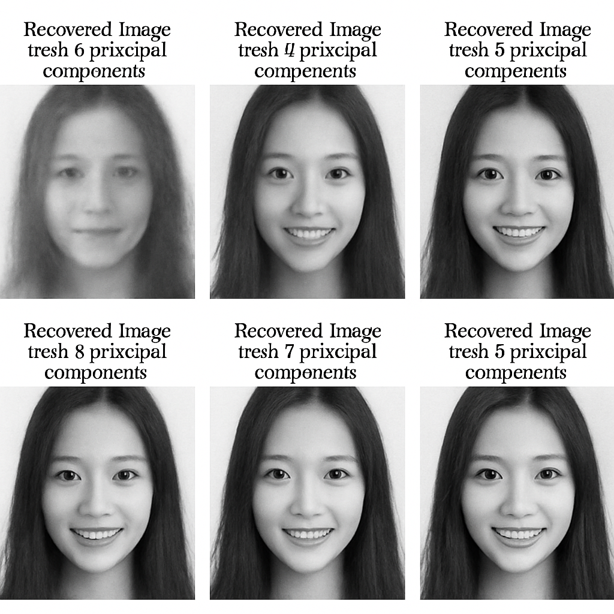

# PCA Faces (Demostración de PCA para Reconstrucción de Imágenes)

Proyecto de ejemplo en Python que muestra paso a paso cómo implementar Análisis de Componentes Principales (PCA) sobre un conjunto de imágenes (dígitos u Olivetti Faces) para reducción de dimensionalidad y reconstrucción aproximada.

---


## 📋 Contenido

* `pca_faces.py`
  Script principal que:

  1. Carga un dataset de imágenes (dígitos 8×8 o Olivetti Faces 64×64).
  2. Centra los datos y calcula la matriz de covarianza.
  3. Obtiene eigenvalores y eigenvectores de Σ.
  4. Proyecta las imágenes en un espacio de dimensión reducida \$k\$.
  5. Reconstruye imágenes usando sólo las \$k\$ componentes principales.
  6. Muestra comparativa original vs. reconstrucción.

* `assets/`
  Carpeta sugerida para almacenar capturas o resultados visuales.

* `README.md`
  Documento de referencia con descripción, fórmulas y ejemplos de uso.

* `venv/`
  Entorno virtual (no incluido en el repositorio; agregar a `.gitignore`).

---

## ❓ ¿Qué muestra esta demostración?

La demostración gráfica compara las **imágenes originales** con sus **reconstrucciones** obtenidas tras proyectar los datos en un espacio de menor dimensión (usando sólo \$k\$ componentes principales). Permite ver cómo PCA conserva la información más relevante y filtra ruido o detalles innecesarios.

---

## 🎯 Objetivos y aplicaciones de PCA en imágenes

* **Reducción de dimensionalidad**: Facilita el procesamiento y almacenamiento de grandes volúmenes de datos de imágenes al mantener solo las características más informativas.
* **Compresión de imágenes**: Permite representar imágenes con menos datos (componentes principales), similar a algoritmos de compresión como JPEG.
* **Reconstrucción y denoising**: Elimina ruido y detalles irrelevantes, mejorando la calidad visual y la robustez de sistemas de visión.
* **Visualización de datos**: Proyecta datos de alta dimensión en 2D o 3D para análisis exploratorio y detección de patrones o anomalías.
* **Preprocesamiento para ML**: Mejora el rendimiento de modelos de clasificación o clustering al reducir la complejidad y evitar el sobreajuste.
* **Reconocimiento facial y biometría**: Extrae las características más relevantes de rostros para sistemas de autenticación o identificación.
* **Medicina e imágenes biomédicas**: Simplifica el análisis de resonancias magnéticas, tomografías o microscopía, realzando señales importantes.
* **Detección de anomalías**: Identifica imágenes atípicas en flujos de video de vigilancia o inspección industrial.

---

## 📐 Fórmula de PCA

El PCA se basa en álgebra lineal y se resume en los siguientes pasos:

1. **Centrar datos**:
   \$X' = X - \mu\$, donde \$\mu = \frac{1}{n}\sum\_{i=1}^n X\_i\$.
2. **Covarianza**:
   \$\Sigma = \frac{1}{n-1} X'^T X'\$.
3. **Eigen-descomposición**:
   \$\Sigma = U \Lambda U^T\$, donde \$U\$ son vectores propios y \$\Lambda\$ valores propios.
4. **Seleccionar componentes**:
   \$U\_k = \[,u\_1,\dots,u\_k]\$, primeros \$k\$ vectores propios.
5. **Proyección**:
   \$Z = X' U\_k\$.
6. **Reconstrucción**:
   \$\hat X = Z U\_k^T + \mu\$.

---

### 🔄 Optimización: PCA eficiente vía SVD

Cuando la dimensión de cada dato (d = h × w píxeles) es muy alta, calcular la matriz de covarianza Sigma directamente puede ser inviable por memoria. En su lugar:

1. **SVD**:
   X' = U S V^T, donde U es n×n, S es n×n y V^T es n×d (con n ≪ d).
2. **Componentes principales**:
   Extraer las primeras k filas de V^T → matriz PC (k×d).
3. **Proyección**:
   Z = X' · PC^T (n×k).
4. **Reconstrucción**:
   X\_hat = Z · PC + mu (n×d).

Con esto evitamos construir matrices d×d y la operación escala en O(n²·d).

## 🚀 Requisitos previos

* Python 3.8+
* pip
* Git

---

## 🛠 Instalación

1. **Clonar repo**

   ```bash
   git clone https://github.com/tu-usuario/pca_faces.git
   cd pca_faces
   ```
2. **Entorno virtual**

   ```bash
   python3 -m venv venv
   source venv/bin/activate   # o .\venv\Scripts\activate en Windows
   ```
3. **Instalar**

   ```bash
   pip install -r requirements.txt
   ```

---

## ▶️ Ejecución

```bash
python pca_faces.py
```

Se abrirá una ventana con primeras imágenes originales y sus reconstrucciones.

---

## 🔧 Parámetros

* **Dataset**: `load_digits()` (8×8), `fetch_olivetti_faces()` (64×64) o imágenes locales.
* **Componentes**: variable `k` en el script.

---

## 📂 Cómo usar imágenes locales

Para usar un conjunto de imágenes almacenadas localmente en la carpeta `assets/` en lugar de los datasets de `scikit-learn`, sigue estos pasos:

1. **Coloca tus imágenes** (formato PNG/JPEG) en `assets/`.
2. **Instala Pillow** (si no lo tienes):

   ```bash
   pip install pillow
   ```
3. **Modifica la carga de datos** en `pca_faces.py`:

   ```python
   import os
   from PIL import Image
   import numpy as np

   # Directorio de imágenes locales
   assets_dir = 'assets'

   # Cargar todas las imágenes y convertir a escala de grises
   image_paths = [os.path.join(assets_dir, f)
                  for f in os.listdir(assets_dir)
                  if f.lower().endswith(('.png', '.jpg', '.jpeg'))]

   # Leer y aplanar cada imagen
   imgs = []
   for path in image_paths:
       img = Image.open(path).convert('L')  # L = luminancia (grises)
       imgs.append(np.array(img).flatten())

   # Crear matriz de datos
   X = np.stack(imgs, axis=0)  # shape (n_samples, h*w)
   h, w = img.size  # tamaño de cada imagen
   ```
4. **Restantes pasos de PCA** no cambian: centrar, covarianza, eigen-descomposición, proyección y reconstrucción.

---

## 🖼️ Ejemplos de imágenes

1. Coloca tus capturas en `assets/`.
2. Inserta en el README con Markdown:

   ```markdown
   
   ```
3. Controla tamaño con HTML si lo necesitas:

   ```html
   
   ```

### 📊 Ejemplo de resultado (grid facial)

<figure>
  
  <figcaption>Figura: Reconstrucciones de una cara usando k=3,4,5,6,7,8 componentes.</figcaption>
</figure>

### 🏥 Ejemplo de resultado (CT recortado)

<figure>
  
  <figcaption>Figura: Escaneo CT recortado para enfocarse en la región abdominal.</figcaption>
</figure>

---

## 📁 Estructura

```
pca_faces/
├── assets/           # Imágenes de ejemplo: grid_reconstructions.png, ct_cropped.png
├── pca_faces.py      # Script principal
├── README.md         # Documentación
├── requirements.txt  # Dependencias
└── venv/             # Entorno virtual
```

```
pca_faces/
├── assets/           # Imágenes de ejemplo
├── pca_faces.py      # Script principal
├── README.md         # Documentación
├── requirements.txt  # Dependencias
└── venv/             # Entorno virtual
```

---

## 🤝 Contribuciones

1. Fork → rama feature
2. Commit claro
3. Pull request

---

## 📝 Licencia

MIT. Ver [LICENSE](LICENSE).

---

## 📌 Autor

**Tu Nombre** — [GitHub](https://github.com/tu-usuario)
#
